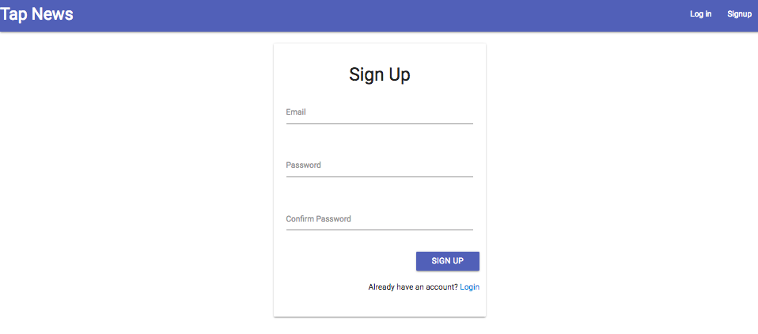
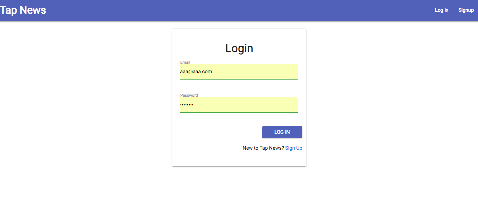

## Customized newfeed
This project is inspired by Google news, was done mainly to practice and improve my fullstack skills.

### Highlights
* Frontend written with **React.js**, featured with signup/login system and newsfeed.
* Backend written with **Node.js** and **Python**. 
* **Data pipeline** from web crawler, news deduper to MongoDB, connected with RabbitMQ
* **Convolutional Neural Networks** for news classification. 
* **Click log** updated user preference.

### Instructions

* Start MongoDB locally at port `27017`.

* frontend-backend run build: 
 	* go to `/web-server/client/`
	* `npm run build`

* backend server:
	* go to `/backend_server/`
	* `python3 service.py`

* web server:
	* go to `/web-server/server/`
	* `npm start`

### User Interface
* Sign Up

* Sign In

* Get newsfeed
